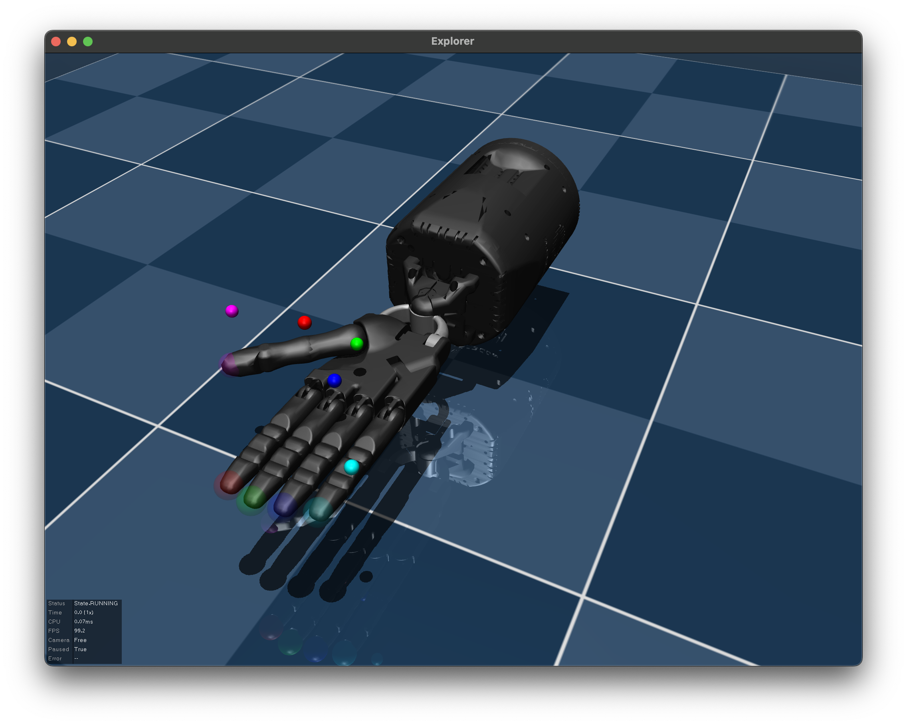
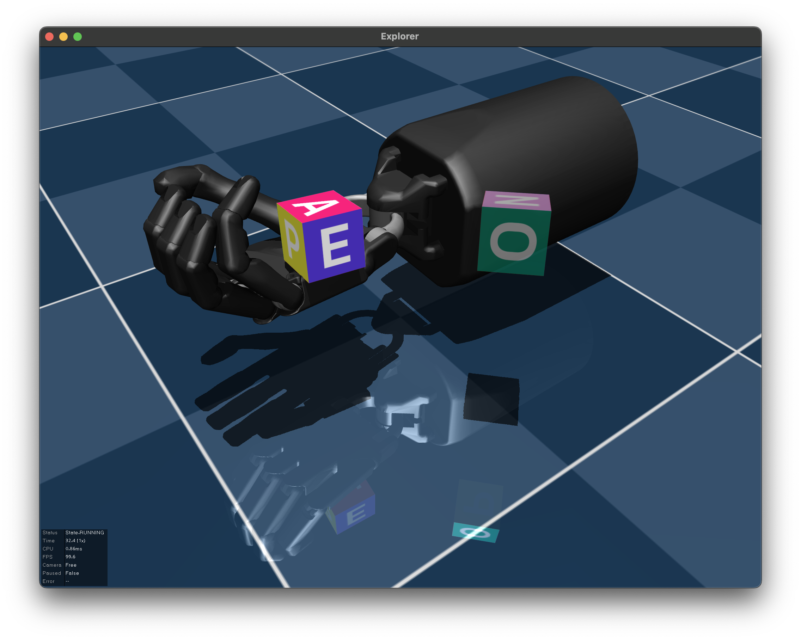
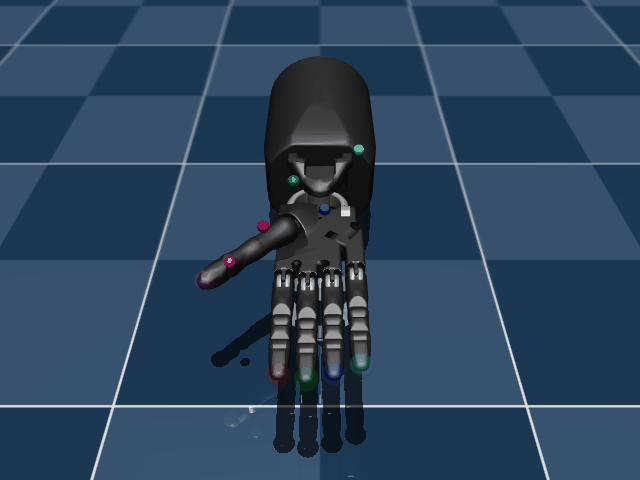
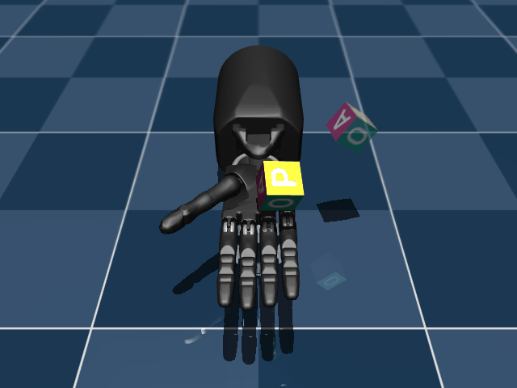

# The MuJoCo Dexterity Suite (alpha-release)

Software and tasks for dexterous multi-fingered hand manipulation, powered by [MuJoCo](https://mujoco.org/).

<p float="left">
  
  
</p>

`dexterity` builds on [dm_control](https://github.com/deepmind/dm_control) and provides a collection of modular components that can be used to define rich Reinforcement Learning environments for dexterous manipulation. It also comes with a set of standardized tasks that can serve as a performance benchmark for the research community.

An introductory tutorial is available as a Colab notebook: [](https://colab.research.google.com/github/kevinzakka/dexterity/blob/main/tutorial.ipynb)

## Installation

### PyPI (Recommended)

The recommended way to install this package is via [PyPI](https://pypi.org/project/dexterity/):

```bash
pip install dexterity
```

### Source

We use Python 3.8 and [Miniconda](https://docs.conda.io/en/latest/miniconda.html) for development. To create an environment and install dependencies, run the following steps:

```bash
conda env create -f environment.yml  # Creates a dexterity env.
conda activate dexterity
pip install -e ".[dev]"
```

## Overview

The MuJoCo `dexterity` suite is composed of the following core components:

* [`models`](dexterity/models/): MuJoCo models for dexterous hands and [PyMJCF](https://github.com/deepmind/dm_control/blob/main/dm_control/mjcf/README.md) classes for dynamically customizing them.
* [`inverse_kinematics`](dexterity/inverse_kinematics/): Inverse kinematics solver for multi-fingered hands.
* [`effectors`](dexterity/effectors/): Interfaces for controlling hands and defining action spaces.

These components in conjunction with `dm_control` allow you to define and customize rich environments for reinforcement learning.

`dexterity` also comes pre-packaged with a suite of benchmark RL environments. Our hope is to grow it over time with crowd-sourced contributions from the research community.

| Task Name   | Description | Preview |
|-------------|-------------|---------|
| `reach`     |Successively controlling the fingers of the hand to reach goal locations in 3D space.||
| `reorient`  |Reorienting the OpenAI cube to a goal orientation.||

## Roadmap

- [ ] Add support for bi-manual tasks.
- [ ] Add more tasks to the suite.

## Acknowledgements

A large part of the design and implementation of `dexterity` is inspired by the [MoMa](https://github.com/deepmind/dm_robotics/tree/main/py/moma) library in [dm_robotics](https://github.com/deepmind/dm_robotics/).
