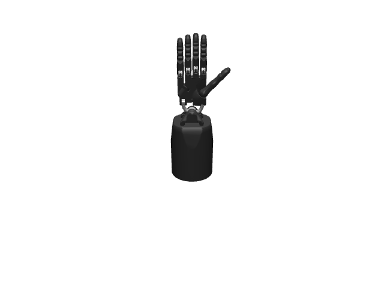

# Shadow Hand

This repository contains code related to my research involving the [Shadow Hand](https://www.shadowrobot.com/).

## Todos

- [ ] Improve all unit tests.
- [ ] Rename `shadow_hand.utils.mujoco_utils.py`.
- [ ] Figure out joint torque and velocity limits. I submitted an [issue](https://github.com/shadow-robot/sr_core/issues/206).
- [x] Add torque sensors and fingertip sites.
- [ ] Implement inverse kinematics.
    - [x] Implement basic pseudoinverse `CartesianVelocitytoJointVelocityMapper`.
    - [ ] Implement LSQP `CartesianVelocitytoJointVelocityMapper`.
    - [ ] Add support for disabling wrist pitch joint (as in OpenAI's [Learning Dexterity](https://arxiv.org/abs/1808.00177)).
    - [ ] Consider speeding up  with C++ implementation if too slow.
- [x] Optimize scene light settings in XML file.
- [ ] Add props to place objects in the palm of the hand.
    - [ ] Load YCB and EGAD objects.
- [x] Implement in-hand manipulation `composer.Task`.
    - [x] Add shaped reward.
    - [x] Add episode termination criteria.
    - [x] Figure out time limit vs max time steps.

## Changelog

## Notes

See [NOTES.md](NOTES.md) for more information.

## Questions

> Is it better to specify damping at the `<joint>` level or have an explicit velocity actuator with a damping gain?

> How do I tune the `<visual>`, `<option>` and `<size>` properties?

> How do I tune `<joint>` properties such as `<damping>`, `<armature>`, `<margin>` and `<frictionloss>`?

> How do I generate an XML file from a dynamically create MJCF model? `to_xml_string()` does not resolve asset paths.

Looks like I can use [export_with_assets.py](https://github.com/deepmind/dm_control/blob/master/dm_control/mjcf/export_with_assets.py) from `dm_control.mjcf`.
