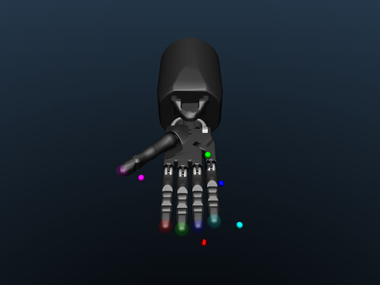
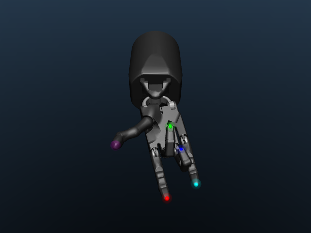

# Inverse Kinematics Library

This library implements an inverse kinematics (IK) solver for dexterous multi-fingered hands. It takes as input Cartesian positions for the fingers of the hand and returns the joint angles needed to place the fingers at those desired positions.

<p float="left">
  
  
</p>

The design of the IK solver is modular in that different solvers can be implemented by hot swapping the underlying controller. Specifically, the solver wraps an instance of [`dexterity.controllers`](../controllers/), which is a library responsible for performing the mapping between Cartesian velocities and joint velocities. The current implementation relies on a simple Jacobian-based [Damped Least Squares] solver. In the future, we'd like to implement more sophisticated controllers, for example, ones that view IK under the lens of [optimization].

## Usage

```python
from dexterity.inverse_kinematics import IKSolver
from dexterity.models import hands

hand = hands.ShadowHandSeriesE()
solver = IKSolver(hand)

# Suppose we are given a Cartesian position for each finger. The frame of reference is
# usually going to be at an `mj_site` on each fingertip.
target_positions = get_fingers_target_positions()
# An array of shape (num_fingers, 3).

qpos = solver.solve(
    target_positions,
    # How close we want to get to the target positions.
    linear_tol=1e-3,
    # How many IK attempts to perform. Each attempt randomizes the initial joint angles
    # to arrive at a different solution.
    num_attemps=5,
    # Whether to exit at the first attempt that finds a solution within the tolerance.
    stop_on_first_successful_attempt=True,
)
# If the solves fails, qpos will be None.
if qpos is not None:
    hand.set_joint_angles(qpos)
```

For a full-fledged example on how to use the solver, see [`examples/inverse_kinematics.py`](../../examples/inverse_kinematics.py).

## References

* The design philosophy of the IK solver, along with the controller it uses, is adapted from **dm_robotic**'s [ik_solver] and [C++ library].
* The [Damped Least Squares] controller is adapted from **dm_control**'s [inverse_kinematics].

[Damped Least Squares]: https://www.cs.cmu.edu/~15464-s13/lectures/lecture6/iksurvey.pdf
[optimization]: https://manipulation.csail.mit.edu/pick.html#diff_ik_w_constraints
[ik_solver]: https://github.com/deepmind/dm_robotics/blob/main/py/moma/utils/ik_solver.py
[C++ library]: https://github.com/deepmind/dm_robotics/tree/main/cpp/controllers
[inverse_kinematics]: https://github.com/deepmind/dm_control/blob/main/dm_control/utils/inverse_kinematics.py#L233
