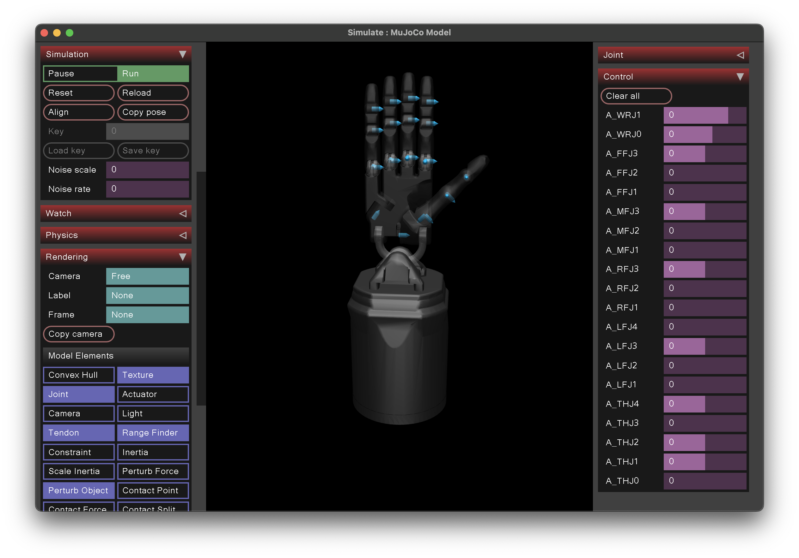
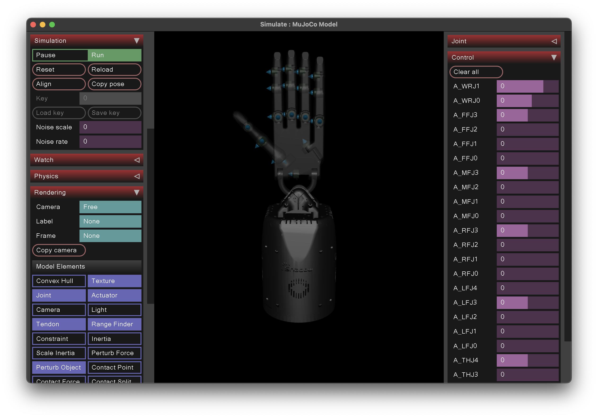

# Hands

This module contains [PyMJCF](https://github.com/deepmind/dm_control/tree/main/dm_control/mjcf) models for various dexterous multi-fingered hands.

## Shadow Hand

[[Link]](https://github.com/shadow-robot/sr_common/tree/noetic-devel/sr_description/mujoco_models)

  

The Shadow Hand model from the Shadow Robot company. It has 24 joints, but only 20 actuators, making it underactuated.

**Changelog.**

* Added custom position actuation.
* Modified the color of the hand.

## Adroit Hand

[[Link]](https://github.com/vikashplus/Adroit)

  

A modified version of the Shadow Hand which makes it fully-actuated. Modified from the original Shadow Hand model by Vikash Kumar.

**Changelog.**

* Modified the color of the hand.
* Decreased the kp values of the actuators.
* Removed non-hand related bodies.
